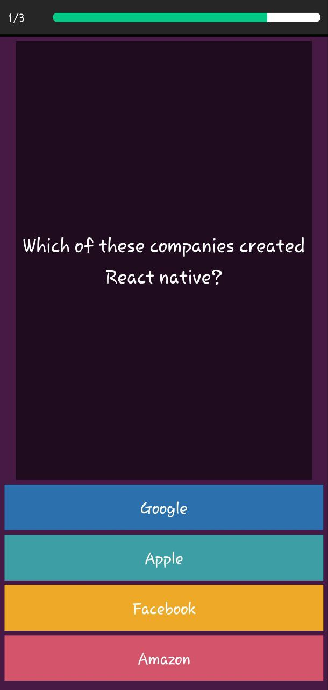

# Quiz App

This is a simple quiz application developed using React Native Expo. It allows users to test their knowledge by answering a series of multiple-choice questions.

## Features

- Multiple-choice questions: The app presents users with a set of questions and provides multiple options to choose from.
- Score tracking: Users can see their current score as they progress through the quiz.
- Timer: A countdown timer keeps track of the remaining time for each question.
- Results: After completing the quiz, users can view their final score.

## Screenshots





## Installation

To use the Quiz App, follow these steps:

1. Clone the repository:

   ```bash
   git clone https://github.com/PaulChase/quiz-app.git

   ```

2. Navigate to the folder:

   ```bash
   cd quiz-app

   ```

3. Install dependencies:

   ```bash
   npm install
   ```
